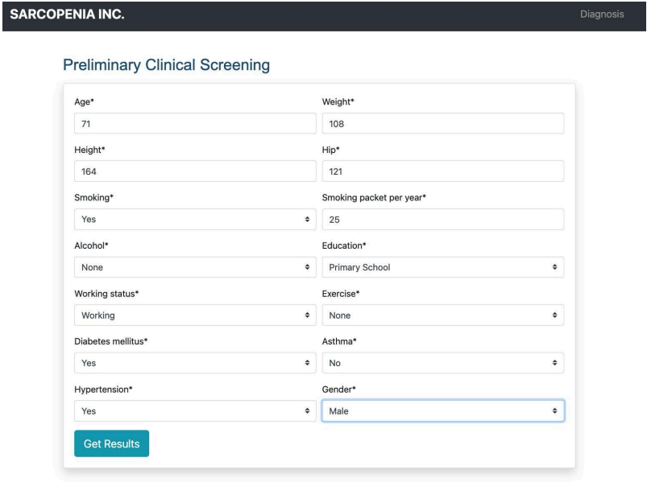
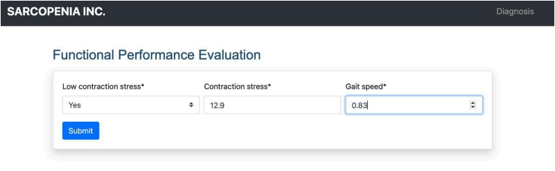
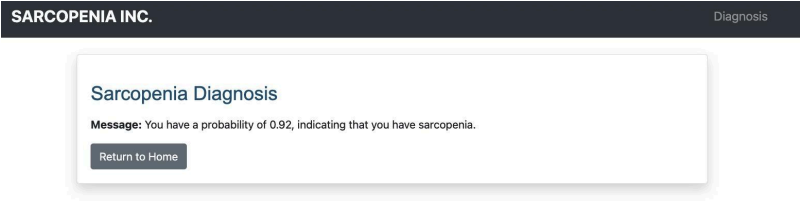

# Sarcopenia Diagnosis System
## Overview
A machine learning-powered diagnostic tool designed to assist healthcare providers in early detection of sarcopenia, a condition characterized by progressive muscle mass and function loss.


## Key Features

- **Multi-Stage Diagnosis:** Uses sequential machine learning models
- **Gender-Specific Analysis:** Tailored prediction models for males and females
- **Adaptive Diagnosis:** Requests additional data for more accurate predictions

## Diagnostic Workflow

### 1. Initial Assessment

- Collect basic patient demographic and health data
- Apply first-stage machine learning model
- Determine initial sarcopenia probability

### 2. Incremental Data Collection

- Request additional features if initial diagnosis is inconclusive
- Apply advanced models with progressively specialized data


### 3. Final Diagnosis

- Provide probability score and sarcopenia likelihood


## Model Architecture

- **Model 1:** Basic demographic and health data
- **Model 2:** Advanced features (contraction stress, gait speed)
- **Model 3:** Specialized health metrics (grip strength)

## Gender-Specific Thresholds
### Female Thresholds

- **Model 1:** 0.65 probability indicates high sarcopenia risk
- **Model 2:** 0.70 probability indicates high sarcopenia risk

### Male Thresholds

- **Model 1:** 0.67 probability indicates high sarcopenia risk
- **Model 2:** 0.72 probability indicates high sarcopenia risk

## Technical Requirements

- Python 3.8+
- Django
- joblib
- scikit-learn
- Additional dependencies in requirements.txt

## Installation
### Clone the repository
```bash
git clone https://github.com/juma-paul/sarcopenia-classifier
cd sarcopenia_project # and create a virtual environment
```
### Install dependencies
```bash
pip install -r requirements.txt
```
### Run migrations
```bash
python manage.py migrate
```
### Start development server
```bash
python manage.py runserver
```
## Contributing

- Fork the repository
- Create a feature branch
- Commit your changes
- Submit a pull request

## License

MIT License ([Link](https://opensource.org/license/mit))

***Note:*** This system is for medical screening and should not replace professional medical advice.